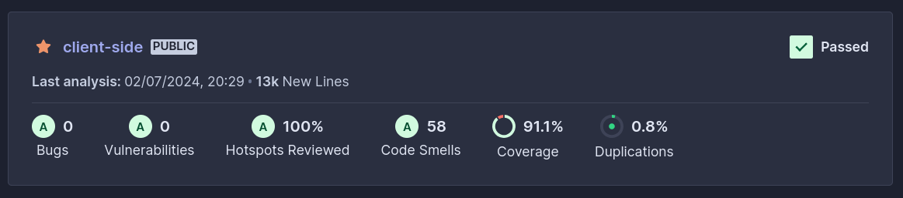
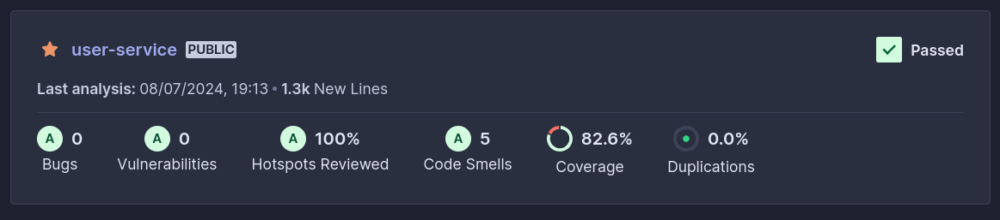
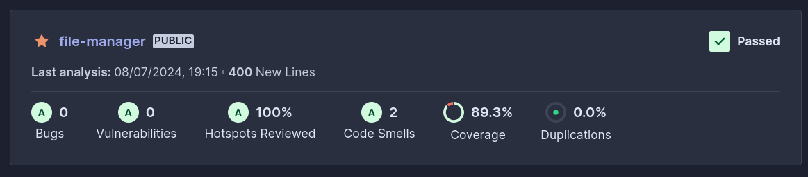
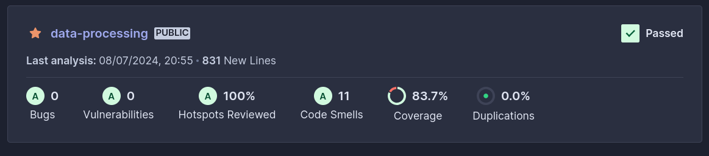
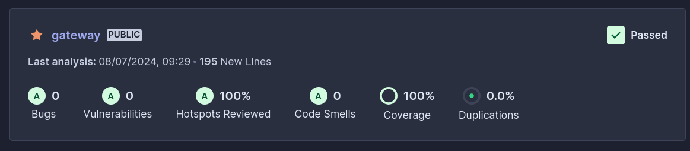
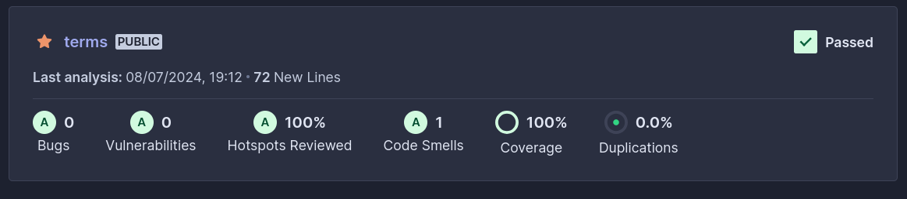
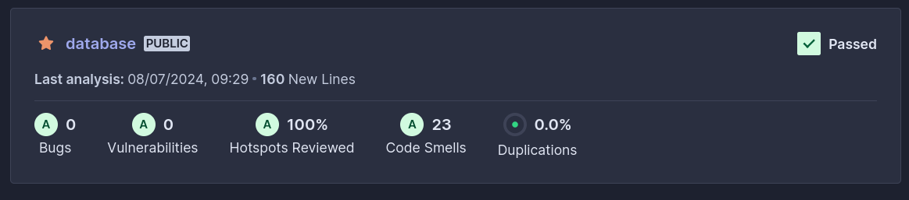

 

    

 

Neste documento, estão delineadas as métricas e indicadores de qualidade utilizados pela equipe, a fim de garantir a qualidade do produto de software.

## Histórico de versões

| Versão |    Data    |           Descrição            |   Autor(es)   | Revisor(es) |
| :----: | :--------: | :----------------------------: | :-----------: | :---------: |
| `1.0`  | 08/07/2024 | Criando documento de Qualidade | Lucas Gabriel |      -      |

Segundo Sociedade da Computação IEEE, qualidade de software é o quão bem um produto de software se adequa aos seus requisitos e atende as necessidades dos usuários, envolvendo o produto de software e o processo para seu desenvolvimento. Diante disso, foram realizadas diversas atividades com intuito de assegurar a qualidade do software produzido, dentre as principais encontra-se o Lean Inception, o Plano de testes, a utilização de Praticas Ágeis e processos de Verificação e Validação de software.

## Verificação e Validação

Os processos de verificação e validação existem para garantir que o produzido satisfaz as necessidades definidas e controlar a qualidade do mesmo. Para verificação do software foram utilizados: programação em pares, testes e Integração Contínua (CI). Já para a validação foram utilizados de Entregas Contínuas (CD) com interações curtas para verificar se o software construido atendia as necessidades dos _Stake Holders_.

## Análise dinâmica

Para a realização da análise dinâmica de código foram utilizados as ferramentas **_Jest_** e **_React Testing Library_** para realização de testes no front-end e **_pytest_**, **_unittest mock_** e **Fast API**  para o desenvolvimento de testes no back-end. Assim, foram realizados testes unitários que garantiram a cobertura de testes de 80% ou maior em todo o código da aplicação. Além disso, tal análise foi integrada a ferramenta **_Sonar Cloud_**, a fim de conectar tal análise à pipeline de desenvolvimento.

## Análise estática de código

Para a realização da análise estática de código a equipe utilizou da ferramenta **_Sonar Cloud_**, a qual é uma solução robustas para softwares que buscam qualidade de código, pois faz verificações de _bugs_, vulnerabilidades e _code smells_ que possam vir a existir na aplicação e os classificando de acordo com a severidade dos mesmos para que a equipe possa tomar melhores decisões.

## Métricas e indicadores de qualidade

A partir disso foram mapeados métricas que possam indicar a qualidade do código produzido para a aplicação, sendo automaticamente avaliadas pelo **_Sonar Cloud_** antes que essas passem pelo _GateWay_ de qualide do estabelecido para a aplicação. Essas métricas são avaliadas para todo novo código introduzido ao sistema.

|       Métrica       |                  Descrição                   |            Critério de aceitação            |
| :-----------------: | :------------------------------------------: | :-----------------------------------------: |
|   Confiabilidade    |   Inexistência da introdução de novos Bugs   |            Classificado como "A"            |
|      Segurança      |       Classificação de confiabilidade        |            Classificado como "A"            |
|  Manutenibilidade   |   Baixa dívida técnica associada ao código   |            Classificado como "A"            |
|      Hotspots       |   Trecho de código sensível para segurança   |            Classificado como "A"            |
| Cobertura de código |  Porcentagem de linhas de código com testes  |    Ao mínimo 80% de cobertura de testes     |
|  Linhas duplicadas  | Duplicações de código existente na aplicação | Número máximo de 3% de duplicação de código |

Nas figuras a seguir é possível observar a visão geral do relatório gerado pela ferramenta de análise da qualidade de código da aplicação para cada repositório:

## Referências

* 
What is Software Quality? IEEE Computer Society. Disponível em: <a href="https://www.computer.org/resources/what-is-software-quality" target="_blank">https://www.computer.org/resources/what-is-software-quality</a>. Acesso em: 8 jul. 2024.

* 
quality gates. Sonarsource.com. Disponível em: <a href="https://docs.sonarsource.com/sonarqube/latest/user-guide/quality-gates" target="_blank">https://docs.sonarsource.com/sonarqube/latest/user-guide/quality-gates</a>. Acesso em: 8 jul. 2024.
‌
* 
Gerência e Qualidade de Software - Aula 05 - Verificação e Validação – UNIVESP
