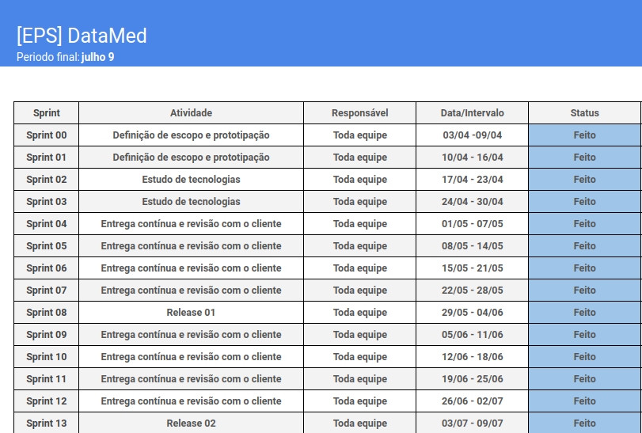

 

    

 

Neste documento, é apresentado o relatório referente ao planejamento e execução da equipe DataMed.

## Histórico de versões

| Versão |    Data    |           Descrição            |  Autor(es)  | Revisor(es) |
| :----: | :--------: | :----------------------------: | :---------: | :---------: |
| `1.0`  | 11/06/2024 | Criando documento de Relatório | Toda Equipe |      -      |
| `1.1`  | 09/07/2024 |   Atualização do cronograma    |    Lucas    |      -      |

## Relatório de Planejamento e Execução

A gestão eficaz do escopo é essencial para o sucesso de qualquer projeto. O escopo de um projeto define os limites do que será realizado, garantindo que todos os requisitos sejam atendidos e que as expectativas dos stakeholders sejam gerenciadas adequadamente. Este trabalho apresenta o planejamento e a execução do escopo do projeto Datamed, uma ferramenta voltada para a área da saúde, utilizando as práticas e princípios delineados na sétima edição do **PMBOK** (Project Management Body of Knowledge). Este guia, desenvolvido pelo Project Management Institute (PMI), é amplamente reconhecido como um padrão de excelência na gestão de projetos. Através de uma abordagem detalhada e baseada em princípios, o **PMBOK 7** oferece um framework que ajuda a garantir que os projetos entreguem valor real aos stakeholders.

### 1 Informações do Projeto

#### 1.1 Nome do Projeto

Datamed

#### 1.2 Descrição do Projeto

Datamed é uma plataforma voltada para a área da saúde, onde os usuários podem submeter exames médicos e gerar cartões de saúde para impressão. A plataforma também permite que um usuário adicione outros usuários para gerenciá-los, facilitando o acompanhamento e a gestão de dados de saúde.
A funcionalidade principal do Datamed é permitir que os usuários submetam exames médicos de forma rápida e segura. Após a submissão, o sistema gera um cartão de saúde que pode ser impresso e carregado pelo usuário, proporcionando fácil acesso às informações de saúde em situações emergenciais. A capacidade de adicionar e gerenciar outros usuários torna a plataforma ainda mais útil, permitindo que pais ou cuidadores acompanhem a saúde de dependentes ou pacientes.

### 2 Stakeholders

#### 2.1 Principais Stakeholders

- **Usuários Comuns:** Indivíduos que utilizam a plataforma para submeter exames e gerar cartões de saúde.
- **Médicos:** Profissionais de saúde que podem gerenciar os exames e os dados de saúde de seus pacientes.

#### 2.2 Expectativas e Necessidades dos Stakeholders:

- **Usuários Comuns:** Facilidade de uso, segurança dos dados, e acesso rápido aos resultados dos exames.
- **Médicos:** Ferramentas eficazes para gerenciar dados de pacientes e funcionalidades avançadas para análise de exames.
- **Desenvolvedores:** Recursos adequados para desenvolver e manter a plataforma, incluindo ferramentas de desenvolvimento e suporte técnico.

Os **stakeholders** do projeto Datamed são diversos e têm necessidades e expectativas variadas. Os usuários comuns necessitam de uma plataforma intuitiva que lhes permita submeter exames e acessar informações de saúde rapidamente. Os médicos, por outro lado, precisam de funcionalidades avançadas para analisar exames e gerenciar dados de pacientes de forma eficiente.

### 3 Requisitos do Projeto

**Principais Requisitos:**
- **Funcionalidade de Submissão de Exames:** Usuários devem poder submeter exames facilmente.
- **Gerar de Cartão de Saúde:** Ferramenta para gerar cartão de saúde impresso a partir dos exames submetidos.
- **Gerenciamento de Usuários:** Possibilidade de adicionar e gerenciar outros usuários.
- **Segurança dos Dados:** Implementação de medidas de segurança robustas para proteger os dados dos usuários.

**Coleta de Requisitos:**
- **Técnicas Utilizadas:** Entrevistas com stakeholders e lean inception.

Os requisitos do projeto Datamed são fundamentais para garantir que a plataforma atenda às necessidades dos usuários e stakeholders. A funcionalidade de submissão de exames é central para o projeto, permitindo que os usuários carreguem exames médicos de forma rápida e eficiente. A geração de um cartão de saúde impresso facilita o acesso às informações em situações emergenciais, aumentando a utilidade da plataforma.
Para garantir a segurança dos dados, serão implementadas medidas de segurança robustas, incluindo criptografia de dados e autenticação segura. A possibilidade de adicionar e gerenciar outros usuários é uma funcionalidade chave que torna o Datamed útil para pais, cuidadores e profissionais de saúde.

### 4 Definição do Escopo

A definição do escopo do projeto Datamed foi alcançada por meio de um processo interativo e colaborativo, envolvendo uma série de etapas bem definidas. Primeiramente, foi realizada uma análise detalhada das necessidades e expectativas dos principais stakeholders (usuários comuns, médicos e desenvolvedores). Isso permitiu uma compreensão abrangente dos requisitos funcionais e não funcionais do sistema. Em seguida, uma série de reuniões foram realizadas para entender as visões e requisitos específicos do projeto, proporcionando insights de quais funcionalidades são essenciais para o projeto, além de preocupações e restrições que deveriam ser consideradas durante o planejamento do escopo.

Por fim, todas as informações coletadas durante as reuniões e criação do documento do lean inception foram documentadas e revisadas pela equipe do projeto e validadas com o cliente garantindo que o escopo estivesse completo, claro e conciso. Este processo permitiu que todos os envolvidos no projeto tivessem uma compreensão comum das metas e entregas esperados, estabelecendo uma base sólida para o sucesso do Datamed.

Quanto aos critérios específicos de aceitação para os entregáveis, estes foram definidos em conjunto com os stakeholders durante o processo de definição do escopo e durante uma série de outras reuniões de planejamento, construção, validação e entrega do projeto. Detalhando os padrões e requisitos que os entregáveis devem atender para serem considerados satisfatórios e aceitos pelo cliente.

### 5 Estrutura Analítica do Projeto (EAP)

A EAP do projeto DataMed foi criado com a seguinte estrutura:

Nível 1: O nível mais geral do projeto. Nesse nível é apresentado o produto em sua totalidade.

Nível 2: Dentro do nível 2 estão as atividades que compõem o projeto. Elas são mais generalizadas e muitas vezes representam as etapas do ciclo de vida do projeto e implicitamente elas são formadas de diversas atividades menores que são descritas no nível 2.

Nível 3: No Nível 3 estão as atividades que compõem as tarefas descritas no Nível 2. Elas são as mais baixas da EAP do DataMed e representam as atividades mais básicas que vão ser realizadas no projeto.

Os principais componentes da EAP são:

Nível 0: Projeto Principal
Este é o nível mais alto da EAP e representa o projeto inteiro. Ele define o objetivo final do projeto.

Nível 1: Entregas Principais ou Fases do Projeto
Este nível divide o projeto em grandes componentes ou fases principais, que são necessários para alcançar o objetivo final. Estas são as entregas de alto nível do projeto.

Nível 2: Subcomponentes das Entregas Principais
Cada entrega principal ou fase do nível 1 é dividida em componentes menores. Estes são os subcomponentes que contribuem para a conclusão das entregas principais.

Nível 3 e seguintes: Pacotes de Trabalho
A decomposição continua até que as entregas sejam divididas em pacotes de trabalho suficientemente detalhados. Um pacote de trabalho é a menor unidade de trabalho na EAP que pode ser gerenciada e controlada. Cada pacote de trabalho deve ser claramente definido e ter uma duração e custo estimados. Eles são os componentes que podem ser atribuídos a um responsável e rastreados durante o ciclo de vida do projeto.

#### EAP do projeto DataMed

### 6 Validação e Controle do Escopo

A validação dos entregáveis do projeto é feita com o principal stakeholder do projeto, o cliente, durante reuniões, onde tudo o que foi planejado e construído é apresentado, debatido entre os stakeholders (desenvolvedores e cliente) e se necessário reformulado de maneira adequada para a validação.

Para garantir a integridade e alinhamento do escopo do projeto Datamed, foram estabelecidos processos controle de mudanças. Foram adotados processo de identificação de mudanças, permitindo capturar de maneira eficaz todas as solicitações de alteração no escopo, sejam elas relacionadas a novos requisitos, exclusão de requisitos ou modificações nos existentes. Cada mudança identificada é avaliada quanto ao seu valor para o projeto, cronograma e recursos necessários, garantindo que qualquer alteração proposta seja compreendida em termos de suas implicações. 

Uma vez que as mudanças foram avaliadas, elas foram submetidas ao processo de aprovação de mudanças, este realizado entre os stakeholders.. Somente após a aprovação adequada as mudanças são implementadas, seguindo os procedimentos estabelecidos e garantindo uma integração suave e controlada no escopo do projeto. Esses processos garantiram não apenas que o escopo permanecesse gerenciável e alinhado com os objetivos do projeto, mas também que qualquer alteração fosse implementada de forma consistente e eficiente.

### 7 Execução do Escopo

O trabalho do projeto será gerenciado pela própria equipe de desenvolvimento, que adotará uma abordagem colaborativa e ágil para garantir a entrega do escopo definido. Para isso, são realizadas reuniões diárias e semanais para revisar o progresso, discutir impedimentos e ajustar o plano de trabalho conforme necessário. A documentação do projeto é mantida na wiki do GitHub, proporcionando uma fonte centralizada de informações acessível a todos os membros da equipe. Além disso, são utilizados canais de comunicação (Teams, Discord e Telegram) para facilitar a troca de informações e a colaboração em tempo real entre os membros da equipe.

Para garantir uma visão clara das atividades do projeto, as histórias de usuários e as issues a fazer e a serem feitas são estruturadas na ferramenta de criação de Roadmap, Backlog e Kanban do GitHub, permitindo uma gestão eficiente das tarefas e uma melhor visibilidade do progresso do projeto. Essas práticas de gerenciamento de trabalho ajudarão a equipe a manter o foco no escopo definido e a alcançar os objetivos do projeto de forma eficaz e colaborativa.

Para garantir que o projeto atenda aos requisitos estabelecidos e mantenha altos padrões de qualidade no desenvolvimento do projeto foi incluído a validação constante dos entregáveis do projeto com o cliente, permitindo uma retroalimentação contínua e ajustes conforme necessário para garantir a satisfação do cliente. Além disso, também é realizado uso da ferramenta Sonar Cloud para garantir a qualidade do código, identificando potenciais problemas de forma proativa. Também é realizada uma ênfase na implementação de testes no código, incluindo testes de unidade, integração e aceitação, para verificar a funcionalidade e a integridade do sistema em diferentes níveis. Essas práticas de qualidade trabalharão em conjunto para garantir que o projeto seja entregue com eficiência, confiabilidade e alinhado com os requisitos estabelecidos.

### 8 Desenvolvimento da Equipe

#### 8.1 - Equipe

Devido ao pré-requisito do projeto da equipe ser dividida em duplas para melhor organização/monitoramento do projeto, utilizamos o quadro de conhecimentos dos alunos para melhor aproveitamento do projeto no prazo estipulado.

Com isso tivemos alunos mais focados em desenvolver os serviços e outros mais focados em desenvolver as telas e todas as equipes reunidas em momentos de integração. Por se tratar de um projeto envolvendo microsserviços, a integração não foi parte determinante em relação à dificuldade do projeto.

#### 8.2 - Treinamentos

Para garantir que a equipe esteja bem equipada para enfrentar os desafios do projeto, os seguintes treinamentos e desenvolvimentos específicos foram planejados:
- **Cursos online e workshops:** Cursos intensivos cobrindo desde conceitos básicos até avançados, incluindo melhores práticas de desenvolvimento.
- **Projetos práticos:** Pequenos projetos para cada tecnologia, revisões de código em pares para promover o aprendizado colaborativo e sessões de feedback para discutir melhorias.
- **Suporte Contínuo:** Reuniões semanais de revisão e resolução de dúvidas.
- **Ferramentas e ambientes de desenvolvimento:** Configuração de ambiente de desenvolvimento padronizados e utilização de ferramentas de gerenciamento de projeto (Git Organization) e implementação de CI/CD.

### 9 Comunicação e Engajamento dos Stakeholders

#### 9.1 Estratégias de Comunicação:
**Reuniões:** Reuniões regulares de status com a equipe de desenvolvimento e stakeholders.

#### 9.2 Engajamento dos Stakeholders:

- **Feedback Contínuo:** Coleta de feedback contínuo dos usuários e stakeholders para melhorias na plataforma.

A comunicação eficaz e o engajamento dos stakeholders são cruciais para o sucesso do projeto Datamed. Manter os stakeholders informados sobre o progresso do projeto através de relatórios regulares de progresso e reuniões de status ajuda a garantir que todos estejam alinhados e cientes dos desenvolvimentos recentes. Isso também permite a identificação e a resolução rápida de quaisquer problemas que possam surgir.

O engajamento contínuo dos stakeholders é igualmente importante. Coletar feedback regular dos usuários e stakeholders ajuda a identificar áreas de melhoria e a garantir que a plataforma atenda às suas necessidades e expectativas. Um feedback contínuo permite ajustes e melhorias durante o desenvolvimento, aumentando a probabilidade de sucesso do projeto.

### 10 Desafios e Riscos 

#### 10.1 Principais Desafios e Riscos:
- **Desafios Técnicos:** Implementação de funcionalidades complexas e integração de sistemas.
- **Segurança dos Dados:** Garantir a proteção e privacidade dos dados dos usuários.
- **Gerenciamento de Mudanças:** Lidar com mudanças de requisitos e escopo durante o desenvolvimento.

#### 10.2 Gerenciamento de Riscos:
- **Identificação de Riscos:** Workshops de identificação de riscos.
- **Mitigação:** Desenvolvimento de planos de contingência e estratégias de mitigação para riscos identificados.

O projeto Datamed enfrenta vários desafios e riscos que precisam ser gerenciados para garantir seu sucesso. Os desafios técnicos incluem a implementação de funcionalidades complexas e a integração de vários sistemas, o que requer habilidades técnicas avançadas e uma coordenação eficaz da equipe de desenvolvimento. Além disso, garantir a segurança e a privacidade dos dados dos usuários é um aspecto crítico, dada a natureza sensível das informações de saúde.

O gerenciamento de mudanças é outro desafio significativo, pois mudanças de requisitos e escopo podem ocorrer durante o desenvolvimento do projeto. Utilizar workshops como por exemplo Brainstorming de Riscos ajudou a equipe a antecipar possíveis problemas e desenvolver planos de contingência para mitigá-los. Ter estratégias eficazes de mitigação de riscos garante que o projeto possa responder rapidamente a quaisquer desafios que surjam, mantendo o cronograma e o orçamento sob controle.

### 11 Informações Adicionais

#### 11.1 Tecnologias e Ferramentas

O Projeto está sendo realizado utilizando diversas tecnologias populares no mercado da Tecnologia da Informação (TI), as quais são amplamente utilizadas por sua eficiência no desenvolvimento de projetos de software robustos.  
Diante disso, o projeto está sendo desenvolvido em uma organização no GitHub, assim tendo todo seu código fonte centralizado com o Git como sua ferramenta de versionamento. O Front-end do mesmo está sendo desenvolvido na linguagem de programação TypeScript com auxílio da biblioteca React e da ferramenta Vite, já o Back-end está sendo desenvolvido em Python usando o framework FastAPI. 
Ademais, estão sendo utilizadas ferramenta para garantir a qualidade dos códigos entregues, no contexto dos testes são usados o Jest e Pytest, os quais estão conectadas à pipeline do GitHub Actions com o **Sonar Cloud** para gerar relatórios referentes a cobertura de testes do projeto, além disso o Sonar Cloud realiza a análise de código estática de todo código gerado pela equipe identificando pontos de melhoria como: possíveis vulnerabilidades de segurança, códigos duplicados e características relacionadas à qualidade do código garantindo o processo de **Continuous Integration (CI)**. Ademais, foi realizado o deploy do Front-end e de todos microsserviços com o banco de dados da aplicação no Render garantindo o processo de **Continuous Deployment (CD)** do projeto. 
Para a gestão do escopo o grupo está utilizando funcionalidades do GitHub que facilitam esse processo, são essas: um Backlog com a lista de itens a serem realizados no projeto, um Roadmap para visualizar o que cada membro precisa desenvolver em um determinado momento e um Quadro Kanban, o qual deixa explícito o status  de cada tarefa do Backlog dividindo elas em: sem status, a fazer, em progresso e feita.

#### 11.2 Prazos e Orçamento

O projeto está sendo realizado seguindo a metodologia ágil do Scrum com Sprints definidas com duração de uma semana cada e utilizando um Quadro Kanban para a organização e visualização do Backlog, a seguir pode ser observado o cronograma da equipe.

Além disso, foi definido um [Plano de gerenciamento de custos](../artefatos/plano_de_gerenciamento_de_custos.md) da equipe para realizar o gerenciamento desse aspecto importante do projeto.

### Referências Bibliográficas
- 1. Project Management Institute. Um Guia do Conhecimento em Gerenciamento de Projetos (Guia PMBOK®) – Sétima Edição. Newtown Square: Project Management Institute, 2021.
- 2. Vargas, Ricardo Viana. Manual Prático do PMBOK. Rio de Janeiro: Brasport, 2015.
- 3. Kerzner, Harold. Gestão de Projetos: As Melhores Práticas. Porto Alegre: Bookman, 2017.
- 4. Heldman, Kim. PMP: Project Management Professional Exam Study Guide. 9th Edition. Indianapolis: Wiley, 2018.
